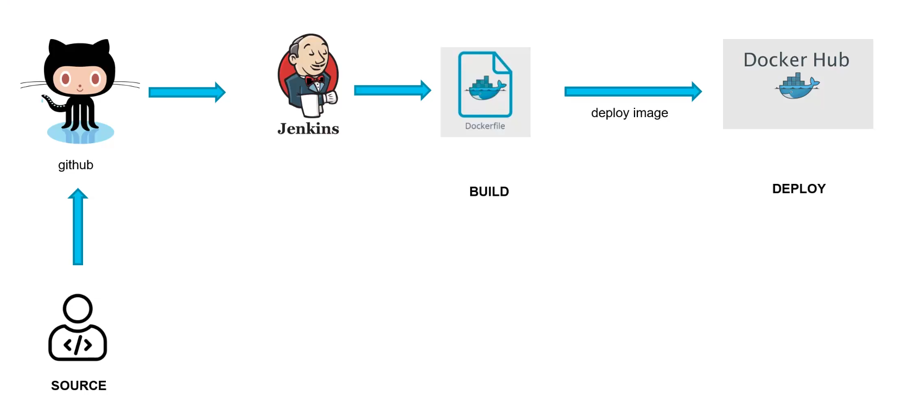
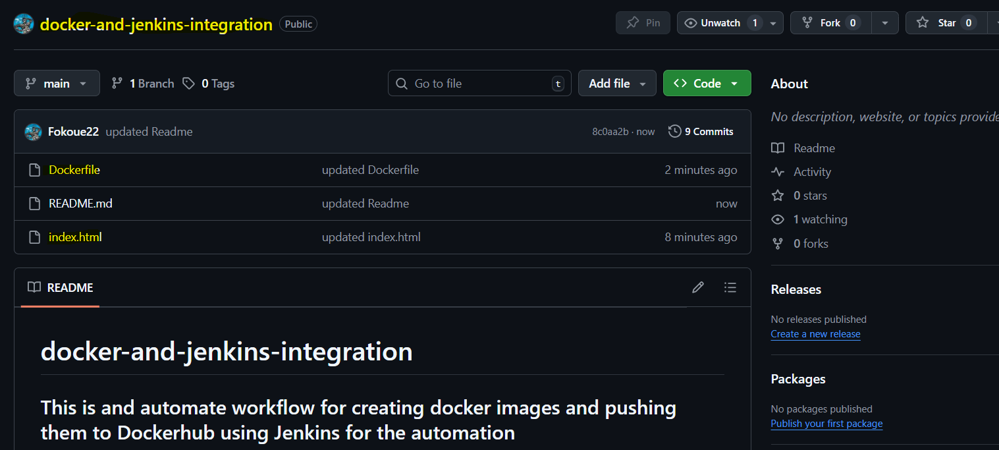
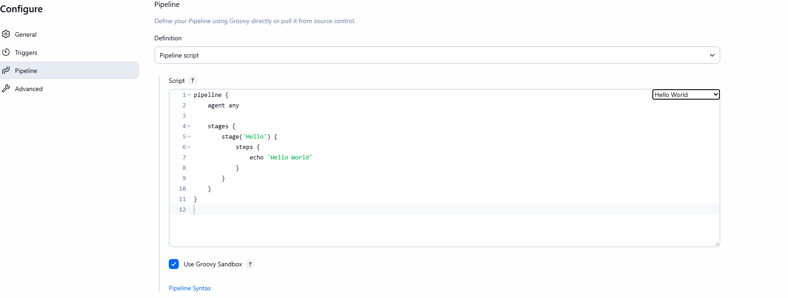
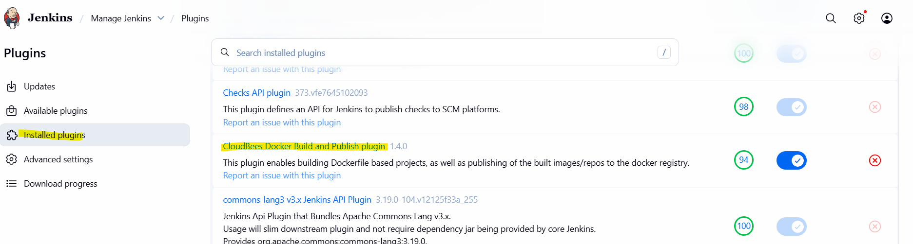
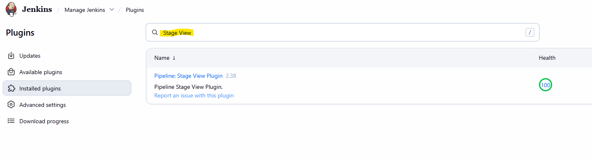
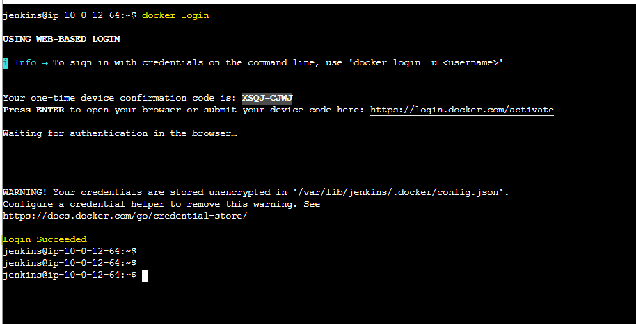

# jenkins-docker-ci-cd-pipeline
This project demonstrates the implementation of a complete Continuous Integration and Continuous Deployment (CI/CD) pipeline using Jenkins, Docker, and Docker Hub.

The pipeline automatically builds a Docker image from the application source code hosted on GitHub, then pushes it to Docker Hub for deployment.
This setup ensures seamless automation from code commit to container deployment, reducing manual steps and improving delivery efficiency.

## 📸 Project Diagram "PIPELINE ARCHITECTURE" 



The pipeline automatically builds a Docker image from the application source code hosted on GitHub, then pushes it to Docker Hub for deployment.
This setup ensures seamless automation from code commit to container deployment, reducing manual steps and improving delivery efficiency.


## ⚙️ Architecture Summary
1. Source: 
   - Developer pushes application code to GitHub repository.
2. Build (Jenkins):
   - Jenkins detects the new commit via a webhook.
   - Jenkins builds the Docker image using the provided Dockerfile.
   - The image is tagged and prepared for deployment.

3. Deploy (Docker Hub):
   - The built Docker image is automatically pushed to Docker Hub.
   - The image can then be pulled and deployed on any server or Kubernetes cluster.


## 🧩 Tools & Technologies
- GitHub → Source code repository and version control
- Jenkins (Ubuntu EC2) → CI/CD automation server build, test, and deployment stages
- Docker → Containerization platform
- Docker Hub → Image registry for deployment

## 🪜 Implementation Steps Summary
### Follow all the steps to install `JENKINS in and UBUNTU server` with the following git repo [this page](https://github.com/Fokoue22/Deploy-Jenkins-on-Ubuntu-EC2-Instance.git)


### 1. Create a GitHub repository with index.html file and a Dockerfile. You can as well pull my own repo. 
```
git pull https://github.com/Fokoue22/docker-and-jenkins-integration.git
```


### 2. Let create our first jenkins pipeline that display `Hello World!` 
1. click on `New Item`(That means i would like to create a job)
2. Enter an item name `docker-image-build-automation-job` select an item type `Pipeline` and press `OK`
3. Click on the newly created job `docker-image-build-automation-job`
4. Go to `Configure` add a `description` go down to `Pipeline` at `at the edge of Script` select `Hello World`
5. Save and run your build by clicking on `Build Now`
6. On your `Build History` on the left click on the first build "#1" and go to `Console Output` and you will see your result.



### 3. Let setup our Git plugin on Jenkins. This is done to link our Jenkins with our repo created on Git
1. Create a `New Item` with name `docker-image-build` select an item type `Freestyle project` and press `OK`
2. Click on the newly created job `my-first-jenkins-job`
3. Go to `Configure` add a `description`. Now go to `Source Code Management` click `Git`  filled all the blank space all 
4. After that on Branch change from master to `main`
5. Save and run your build by clicking on `Build Now`
6. On your `Build History` on the left click on the first build "#1" and go to `Console Output` and you will see your result.


### 4. Let look for a Plugins that will help us to publish a docker image and see the pipeline. 
1. Go to `Manage Jenkins` click on `Plugins` then go to `Available Plugins`
2. On Available Plugins click on the search bar and type `CloudBees Docker Build and Publish` & `stage view` Select the Plugins and Install 
4. Go to `Install Plugins` to see the docker plugin that have been install  



### 5. Now let Installed docker on our Ubuntu server in other for us to use the plugin install above linux server:
- Take up you privilage. the first command for ubuntu and the second for linux. 
```
sudo su - ubuntu
```
```
sudo su - ec2-user
```
- let verifie if docker is install 
```
 docker --version
```
- After the verification we notice docker is not install. So we need to go to the officail documentation [this page](https://docs.docker.com/engine/install/ubuntu/) depending on our OS we follow the steps and install. For us is Installing Docker on Linux 
- Update the installed packages and package cache on your instance.
```
 sudo apt update -y
```
- Before you install Docker Engine for the first time on a new host machine, you need to set up the Docker apt repository. Afterward, you can install and update Docker from the repositor
```
 # Add Docker's official GPG key:
sudo apt-get update
sudo apt-get install ca-certificates curl
sudo install -m 0755 -d /etc/apt/keyrings
sudo curl -fsSL https://download.docker.com/linux/ubuntu/gpg -o /etc/apt/keyrings/docker.asc
sudo chmod a+r /etc/apt/keyrings/docker.asc

# Add the repository to Apt sources:
echo \
  "deb [arch=$(dpkg --print-architecture) signed-by=/etc/apt/keyrings/docker.asc] https://download.docker.com/linux/ubuntu \
  $(. /etc/os-release && echo "${UBUNTU_CODENAME:-$VERSION_CODENAME}") stable" | \
  sudo tee /etc/apt/sources.list.d/docker.list > /dev/null
sudo apt-get update
```
- Install the most recent Docker Community Edition package
```
 sudo apt-get install docker-ce docker-ce-cli containerd.io docker-buildx-plugin docker-compose-plugin
```
- Add the ubuntu and Jenkins to the docker group so that you can run Docker commands without using sudo.
```
 sudo usermod -a -G docker ubuntu
```
- After running the command above logout and login again for the permission to be succesfull.
```
 exit
```
- This command keep our docker up at all time. No matter if our instance is stop docker will still be active in this server. 
```
 sudo systemctl enable docker
```
- Activate docker and verify that the ubuntu can run Docker commands without using sudo.
```
 sudo systemctl status docker
```
```
 docker ps
```


### 6. Create a Build Steps in Jenkins for Docker
1. Go to our  a `New Item` with name `docker-image-build` created above
2. Go down to `Build Steps` and chose `Docker Build and Publish` 
3. On `Repository Name` add a repo-name present in your Docker Hub account. Add a `Tag e.g v2` leave everything default. Then add `Registry credentials` for your DockerHub account 


4. Before you save make sure to restart your Jenkins on your server. Then exit and login as jenkins 
```
 sudo systemctl start docker
 sudo usermod -aG docker jenkins
 sudo systemctl restart jenkins

```
```
 exit
```
```
 sudo su - jenkins
```
```
 docker info
```
5. Save and run your build by clicking on `Build Now`
6. On your `Build History` on the left click on the first build "#1" and go to `Console Output` and you will see your result.


### 7. Login to docker hub using ubuntu server.
```
docker login
```


### 11. Succesful deploy our `docker-image-build`.


### 12. Jenkins build and push our image to DockerHub.


### 13. Let build the image and run the conatainer just uploaded by jenkins in our DockerHub.
- Make sur to be on your ubuntu server before running the command below
```
sudo su - ubuntu
```
- Build the image
```
  docker pull fokoue/jenkins_thomas_container:v2
```
- Run the container
```
  docker run -t -d -p 80:80 fokoue/jenkins_thomas_container:v2
```


- Then open your browser and go to
```
  http://<EC2-Public-IP>
```


## Author
FOKOUE THOMAS 