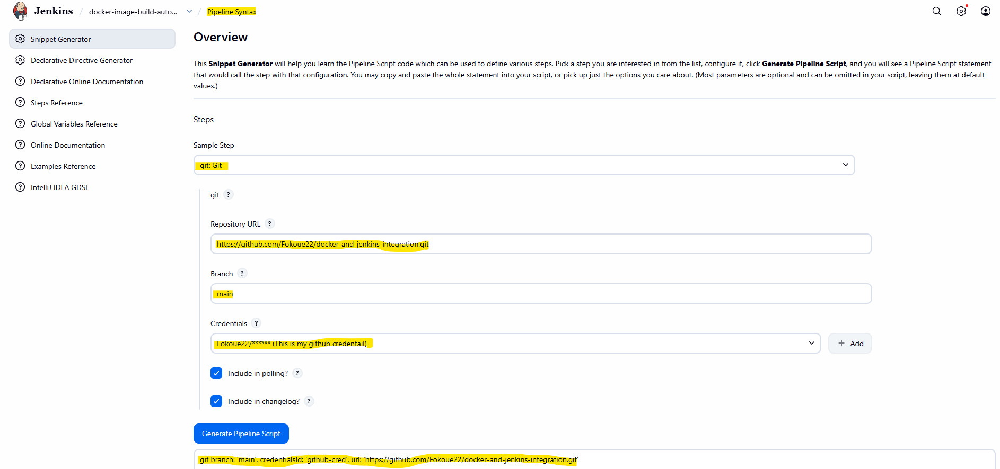
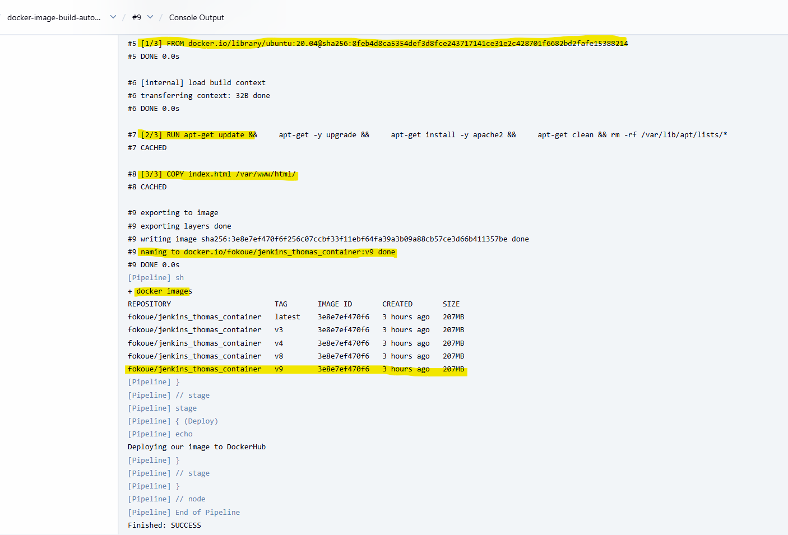

# jenkins-docker-ci-cd-pipeline
This project demonstrates the implementation of a complete Continuous Integration and Continuous Deployment (CI/CD) pipeline using Jenkins, Docker, and Docker Hub.

The pipeline automatically builds a Docker image from the application source code hosted on GitHub, then pushes it to Docker Hub for deployment.
This setup ensures seamless automation from code commit to container deployment, reducing manual steps and improving delivery efficiency.

## 📸 Project Diagram "PIPELINE ARCHITECTURE" 


The pipeline automatically builds a Docker image from the application source code hosted on GitHub, then pushes it to Docker Hub for deployment.
This setup ensures seamless automation from code commit to container deployment, reducing manual steps and improving delivery efficiency.


## ⚙️ Architecture Summary
1. Source: 
   - Developer pushes application code to GitHub repository.
2. Build (Jenkins):
   - Jenkins detects the new commit via a webhook.
   - Jenkins builds the Docker image using the provided Dockerfile.
   - The image is tagged and prepared for deployment.

3. Deploy (Docker Hub):
   - The built Docker image is automatically pushed to Docker Hub.
   - The image can then be pulled and deployed on any server or Kubernetes cluster.


## 🧩 Tools & Technologies
- GitHub → Source code repository and version control
- Jenkins (Ubuntu EC2) → CI/CD automation server build, test, and deployment stages
- Docker → Containerization platform
- Docker Hub → Image registry for deployment

## 🪜 Implementation Steps Summary
### Follow all the steps to install `JENKINS in and UBUNTU server` with the following git repo [this page](https://github.com/Fokoue22/Deploy-Jenkins-on-Ubuntu-EC2-Instance.git)


### 1. Create a GitHub repository with index.html file and a Dockerfile. You can as well pull my own repo. 
```
git pull https://github.com/Fokoue22/docker-and-jenkins-integration.git
```


### 2. Let setup our Git plugin on Jenkins. This is done to link our Jenkins with our repo created on Git
1. Create a `New Item` with name `docker-image-build` select an item type `Freestyle project` and press `OK`
2. Click on the newly created job `my-first-jenkins-job`
3. Go to `Configure` add a `description`. Now go to `Source Code Management` click `Git`  filled all the blank space all 
4. After that on Branch change from master to `main`
5. Save and run your build by clicking on `Build Now`
6. On your `Build History` on the left click on the first build "#1" and go to `Console Output` and you will see your result.


### 3. Let look for a Plugins that will help us to publish a docker image and see the pipeline. 
1. Go to `Manage Jenkins` click on `Plugins` then go to `Available Plugins`
2. On Available Plugins click on the search bar and type `CloudBees Docker Build and Publish` & `stage view` Select the Plugins and Install 
4. Go to `Install Plugins` to see the docker plugin that have been install  


### 4. Let create our first jenkins pipeline that display `Hello World!` 
1. click on `New Item`(That means i would like to create a job)
2. Enter an item name `docker-image-build-automation-job` select an item type `Pipeline` and press `OK`
3. Click on the newly created job `docker-image-build-automation-job`
4. Go to `Configure` add a `description` go down to `Pipeline` at `at the edge of Script` select `Hello World`
5. Save and run your build by clicking on `Build Now`
6. On your `Build History` on the left click on the first build "#1" and go to `Console Output` and you will see your result.


7. Let go back to `Configure` of the newly created pipeline juste below the `Hello World` pipeline we created and select `Pipeline Syntax`
8. From there let add our `git plugins` juste created above 
9. Then click on `Generate Pipeline Script` and copy it 



### 5. Source Stage: let edite our Pipeline edge of Script
1. Let go back to `Configure` of the newly created pipeline
2. Go down to `Pipeline` at `at the edge of Script` and motified it as shown below
3. Update the Souce stage credentail with your own `Generate Pipeline Script` done above 
5. Save and run your build by clicking on `Build Now`
```
pipeline {
    agent any

    stages {
        stage('Source') {
            steps {
                echo 'Logging into our GitHub account'
                git branch: 'main', credentialsId: 'github-cred', url: 'https://github.com/Fokoue22/docker-and-jenkins-integration.git'
            }
        }

        stage('Build') {
            steps {
                echo 'Building our Docker image'
            }
        }

        stage('Deploy') {
            steps {
                echo 'Deploying our image to DockerHub'
            }
        }
    }
}
```


### 6. Bluild Stage: let edite our Pipeline edge of Script
1. Let go back to `Configure` of the newly created pipeline juste below the `Hello World` pipeline we created and select `Pipeline Syntax`
2. From there let select `sh:Shell Script`
3. On the Shell Script add the following command 
```
 docker build -t fokoue/jenkins_thomas_container:v4 .
```
4. Then click on `Generate Pipeline Script` and copy it 


5. Let go back to `Configure` of the newly created pipeline
6. Go down to `Pipeline` at `at the edge of Script` and motified it as shown below
7. Update the Souce stage credentail with your own `Generate Pipeline Script` done above
8. Save and run your build by clicking on `Build Now`
9. Optional: let add `${BUILD_NUMBER}` to our code copy from `Global Variable Reference`. This will automaticatly add the version number to our dockerhub.
10. `Optional:` We can also use `enviroment variables` to define some code that are contante in our code use the officail documentation [this page](https://www.jenkins.io/doc/pipeline/tour/environment/)
```
pipeline {
    agent any
    environment {
        DOCKERHUB_REPO = 'fokoue/jenkins_thomas_container'
    }
    stages {
        stage('Source') {
            steps {
                echo 'Logging into our GitHub account'
                git branch: 'main', credentialsId: 'github-cred', url: 'https://github.com/Fokoue22/docker-and-jenkins-integration.git'
            }
        }

        stage('Build') {
            steps {
                echo 'Building our Docker image'
                sh ' docker build -t ${DOCKERHUB_REPO}:v${BUILD_NUMBER} .'
                sh 'docker images'
            }
        }

        stage('Deploy') {
            steps {
                echo 'Deploying our image to DockerHub'
            }
        }
    }
}

```


### 7. Deploy Stage: let edite our Pipeline edge of Script
1. `enviroment variables` to add our dockerhub credentail created above. Let use the officail documentation [this page](https://www.jenkins.io/doc/book/pipeline/jenkinsfile/#handling-credentials)
2. copy the command below then modified it. In the credentials use your Dockerhub id created above 
```
 AWS_ACCESS_KEY_ID = credentials('jenkins-aws-secret-key-id')
```


5. Let publish(push) the image to our repository
```
  sh 'docker push ${DOCKERHUB_REPO}:v${BUILD_NUMBER}'
```
6. Go down to `Pipeline` at `at the edge of Script` and motified it as shown below
7. Update the Souce stage credentail with your own `Generate Pipeline Script` done above
8. Save and run your build by clicking on `Build Now`
```
pipeline {
    agent any
    environment {
        DOCKERHUB_REPO = 'fokoue/jenkins_thomas_container'
        DOCKERHUB_CREDS  = credentials('docker-credd')
    }
    stages {
        stage('Source') {
            steps {
                echo 'Logging into our GitHub account'
                git branch: 'main', credentialsId: 'github-cred', url: 'https://github.com/Fokoue22/docker-and-jenkins-integration.git'
            }
        }

        stage('Build') {
            steps {
                echo 'Building our Docker image'
                sh ' docker build -t ${DOCKERHUB_REPO}:v${BUILD_NUMBER} .'
                sh 'docker images'
            }
        }

        stage('Deploy') {
            steps {
                echo 'Deploying our image to DockerHub'
                sh 'docker login -u ${DOCKERHUB_CREDS_USR} -p ${DOCKERHUB_CREDS_PSW}'
                sh 'docker push ${DOCKERHUB_REPO}:v${BUILD_NUMBER}'
            }
        }
    }
}

```
 
 

### 8. Running Stage: let edite our Pipeline edge of Script
1. Let add the running stage to our pipeline. So we need to run the image with the comand below
```
  sh ' docker run --name testing -t -d -p 80:80 ${DOCKERHUB_REPO}:v${BUILD_NUMBER}'
```
2. After this use your public IP to view the contain of that image
```
pipeline {
    agent any
    environment {
        DOCKERHUB_REPO = 'fokoue/jenkins_thomas_container'
        DOCKERHUB_CREDS  = credentials('docker-credd')
    }
    stages {
        stage('Source') {
            steps {
                echo 'Logging into our GitHub account'
                git branch: 'main', credentialsId: 'github-cred', url: 'https://github.com/Fokoue22/docker-and-jenkins-integration.git'
            }
        }

        stage('Build') {
            steps {
                echo 'Building our Docker image'
                sh ' docker build -t ${DOCKERHUB_REPO}:v${BUILD_NUMBER} .'
                sh 'docker images'
            }
        }

        stage('Deploy') {
            steps {
                echo 'Deploying our image to DockerHub'
                sh 'docker login -u ${DOCKERHUB_CREDS_USR} -p ${DOCKERHUB_CREDS_PSW}'
                sh 'docker push ${DOCKERHUB_REPO}:v${BUILD_NUMBER}'
            }
        }
       stage('Run') {
            steps {
                echo 'Running our Docker image'
                sh ' docker run --name testing -t -d -p 80:80 ${DOCKERHUB_REPO}:v${BUILD_NUMBER}'
            }
        }
    }
}
```


## Author
FOKOUE THOMAS 